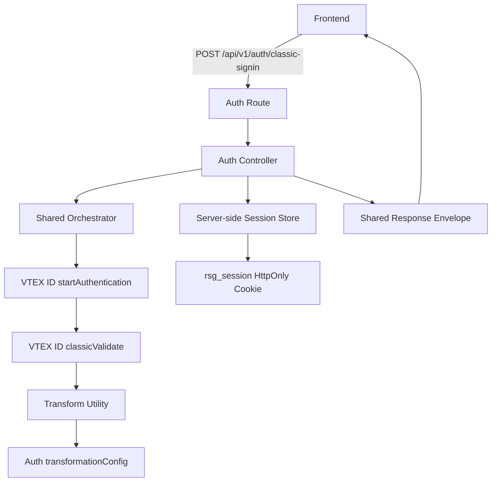
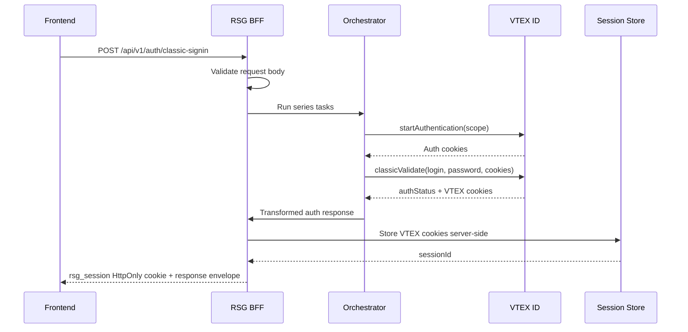

# RSG BFF New Developer Architecture Guide

This document is for developers joining `rsg-bff-new` from day one. It explains the foundation of the new BFF architecture, request flows, module responsibilities, cookie handling, VTEX security rules, BFF best practices, and the steps required to add a new API.

## 1. Purpose

`rsg-bff-new` is a pilot framework for migrating the existing `rsg-bff` into a cleaner frontend-owned BFF architecture.

The goal is not to create a large backend framework. The goal is to create a simple, repeatable pattern where each frontend API:

- Lives inside a business domain.
- Calls downstream systems through domain integrations.
- Uses an orchestrator for multi-step API flows.
- Uses config-driven transformation instead of manual mapping.
- Protects VTEX credentials and shopper cookies.
- Returns consistent success and error envelopes.

## 2. Core Mental Model

The preferred request path is:

```text
route -> controller -> orchestrator -> domain integration -> transformer config -> response
```

Controllers should stay thin. They validate input, define orchestration, manage BFF-owned cookies when needed, and send the response.

Domain integrations talk to VTEX or other downstream services.

Shared code exists only for reusable mechanics like HTTP, errors, schemas, logging, transformation, and sessions.

## 3. High-Level Architecture Flow



## 4. Current Pilot API

The current pilot API is:

```text
POST /api/v1/auth/classic-signin
```

The endpoint performs:

1. Validates the frontend request body.
2. Calls VTEX ID `startAuthentication`.
3. Passes cookies from `startAuthentication` into VTEX ID `classicValidate`.
4. Transforms the VTEX response using `classicSigninAPI`.
5. Stores VTEX cookies server-side.
6. Returns only `rsg_session` to the browser.
7. Sends a shared response envelope.

## 5. Login Sequence



## 6. Folder Responsibilities

### `src/modules`

Business domain code lives here.

Current domains:

- `auth`
- `health`

### `src/modules/auth`

Owns shopper authentication and account-entry flows.

Important files:

- `auth.routes.ts`: Registers auth routes and route schemas.
- `auth.controller.ts`: Validates request, defines orchestration, creates session.
- `auth.schema.ts`: Zod and JSON schemas for request/response.
- `auth.types.ts`: Auth-specific TypeScript contracts.
- `config/transformationConfig.ts`: Frontend-facing transformation rules.
- `integrations/vtex-id`: VTEX ID downstream integration.
- `tests`: Auth route and transformation tests.

There is no `auth.service.ts` right now because it was only a pass-through. Add a service later only if the domain has real business logic.

### `src/modules/routes.ts`

Central domain route registry.

This prevents `server.ts` from becoming a long list of every endpoint.

### `src/shared`

Reusable building blocks live here.

Important folders:

- `constants`: HTTP methods, status codes, headers, API prefix.
- `errors`: `AppError`, global error handler, simple error registry.
- `http`: Shared `HttpClient` with timeout, retry, logging, and error mapping.
- `orchestrator`: Series/parallel downstream task runner.
- `plugins`: Fastify request context logging plugin.
- `response`: Success/error envelope helpers.
- `schema`: Shared JSON schema helpers.
- `session`: BFF-owned session cookie and server-side VTEX cookie storage.
- `transformer`: Generic config-driven transformation engine.
- `utils`: Request validation, logging, safe cookie parsing.
- `types`: Shared API response types.

## 7. Transformation Pattern

Transformation follows the KT pattern:

```text
Controller -> Orchestrator -> transformUtility -> transformationConfig
```

The controller gives the orchestrator a string key:

```ts
transformationOptions: {
  transformConfigKey: "classicSigninAPI",
}
```

The actual mapping lives in `src/modules/auth/config/transformationConfig.ts`:

```ts
export const classicSigninAPI = {
  authStatus: { from: ["authStatus"] },
};
```

### Good Practice

Use transformation config:

```ts
transformationOptions: {
  transformConfigKey: "classicSigninAPI",
}
```

### Bad Practice

Do not manually map downstream fields in controllers:

```ts
return {
  authStatus: response.authStatus,
};
```

## 8. Error Handling

The BFF has one main error class: `AppError`.

The global Fastify error handler converts errors into a shared envelope:

```json
{
  "success": false,
  "data": null,
  "error": {
    "code": "AUTH_INVALID_CREDENTIALS",
    "message": "Invalid email or password"
  },
  "meta": {
    "requestId": "...",
    "timestamp": "..."
  }
}
```

Downstream-specific error shapes are normalized in `shared/errors/errorRegistry.ts`.

Example:

```ts
vtexId: {
  WrongCredentials: {
    statusCode: 401,
    errorCode: "AUTH_INVALID_CREDENTIALS",
    message: "Invalid email or password",
  },
}
```

This handles different downstream formats such as:

```ts
{ code: "WrongCredentials" }
{ error: "WrongCredentials" }
{ message: "WrongCredentials" }
```

## 9. Cookie Management

VTEX cookies must never be returned directly to browser JavaScript.

Current flow:

1. VTEX returns cookies from `startAuthentication` and `classicValidate`.
2. `HttpClient` extracts cookie pairs from `set-cookie`.
3. `mergeCookies()` filters malformed or unsafe cookie pairs.
4. `createSession()` stores VTEX cookies server-side.
5. BFF sends only one browser cookie: `rsg_session`.
6. `rsg_session` is `HttpOnly`, `SameSite=Strict`, and `Secure` in production.


### Production Note

The current session storage is in-memory for the pilot. For production, replace it with Redis, encrypted server-side session storage, or another shared store.

In-memory storage is not safe for multi-replica production deployments because sessions disappear when the process restarts or traffic goes to another instance.

## 10. Logging

Fastify uses Pino logger.

We log:

- Incoming BFF request metadata.
- Redacted headers.
- Request ID and correlation ID.
- Orchestrator task lifecycle.
- Downstream HTTP request start, retry, success, failure.
- Network errors.

We do not log:

- Request body.
- Response body.
- Cookies.
- Authorization headers.
- VTEX app key/token.
- Full downstream URLs with query parameters.

This follows the rule: logs should help debugging without leaking shopper or credential data.

## 11. VTEX Skill vs BFF Skill

### VTEX Security Guidance

VTEX/headless guidance says:

- A BFF is mandatory for headless VTEX except safe public search cases.
- Never expose `VTEX_APP_KEY` or `VTEX_APP_TOKEN` to the browser.
- Never expose `VtexIdclientAutCookie` to browser JavaScript.
- Store shopper auth cookies server-side.
- Redact sensitive headers in logs.
- Use minimal API credentials per domain in future production setup.

### BFF Architecture Guidance

BFF guidance says:

- Organize by domain, not API path.
- Keep downstream integrations inside the owning domain.
- Use orchestration for multi-call flows.
- Use config-driven transformation.
- Keep shared infrastructure small.
- Avoid empty framework files.
- Add abstractions only when real APIs need them.

### What We Did

- VTEX ID integration lives under `modules/auth/integrations/vtex-id`.
- VTEX cookies are stored server-side.
- Browser receives only `rsg_session`.
- Logs redact sensitive headers.
- Controller uses the orchestrator.
- Response transformation is config-driven.
- Error mapping is centralized but simple.
- Pass-through services and unused permission skeletons were removed.

## 12. Adding A New API

Use this checklist.

### Step 1: Identify The Domain

If it belongs to an existing domain, add it there:

```text
src/modules/auth
src/modules/checkout
src/modules/product
```

If it is a new domain, create:

```text
src/modules/<domain>/
├── config/
│   └── transformationConfig.ts
├── integrations/
│   └── <downstream>/
├── tests/
├── <domain>.controller.ts
├── <domain>.routes.ts
├── <domain>.schema.ts
└── <domain>.types.ts
```

Add `<domain>.service.ts` only when there is real domain business logic. Do not create pass-through services.

### Step 2: Define The Frontend Contract

Before writing VTEX code, decide what the frontend should send and receive.

The frontend contract should drive the BFF API, not the downstream VTEX response shape.

### Step 3: Add Request And Response Schemas

Use Zod for runtime validation and JSON schema for Fastify/OpenAPI docs.

Avoid permissive schemas like `additionalProperties: true` unless there is a clear reason.

### Step 4: Add The Route

In `<domain>.routes.ts`, define:

- HTTP method.
- URL.
- Request schema.
- Response schemas.
- Handler.

### Step 5: Add Controller Logic

Controller should:

- Validate request.
- Define orchestration tasks.
- Pass request context.
- Set cookies/session if needed.
- Return shared response.

### Step 6: Add Downstream Integration

Put VTEX/API calls under:

```text
src/modules/<domain>/integrations/<service>/
```

Use `HttpClient` for downstream calls.

### Step 7: Add Transformation Config

Add mapping in:

```text
src/modules/<domain>/config/transformationConfig.ts
```

Register it in the shared transformer config registry if the orchestrator will use it by key.

### Step 8: Add Error Mappings

If downstream returns known error codes, add them to:

```text
src/shared/errors/errorRegistry.ts
```

Keep it simple: one section per downstream service, one entry per known error.

### Step 9: Add Tests

At minimum:

- Route success/error test.
- Transformation config test.
- Cookie/security test if cookies are involved.
- HTTP/error mapping test if new downstream error behavior is added.

### Step 10: Register The Domain Route

If it is a new domain, add it to:

```text
src/modules/routes.ts
```

## 13. Good Practices

- Keep code domain-first.
- Keep controllers thin.
- Put VTEX-specific code inside domain integrations.
- Use `HttpClient` for downstream calls.
- Use orchestrator for multi-step or parallel flows.
- Use transformation config instead of manual mapping.
- Return consistent response envelopes.
- Redact secrets in logs.
- Store VTEX auth cookies server-side.
- Add files only when needed.

## 14. Bad Practices

- Do not organize by `/api/v1/...` folders.
- Do not create one controller per small API when the domain can own it cleanly.
- Do not pass raw VTEX responses to the frontend.
- Do not manually map fields in controllers.
- Do not expose VTEX cookies to browser JavaScript.
- Do not log cookies, auth headers, or VTEX credentials.
- Do not add service, prehandler, projection, aggregator, or circuit-breaker files unless a real API needs them.
- Do not retry in both orchestrator and HTTP client.
- Do not create global VTEX clients for domain-specific behavior.

## 15. Day-One Developer Summary

When working in this repo, think:

```text
Frontend owns the contract.
BFF owns orchestration and safety.
VTEX integration is an implementation detail.
Transformation config decides what frontend receives.
Shared code should stay small.
```

That is the foundation of `rsg-bff-new`.
